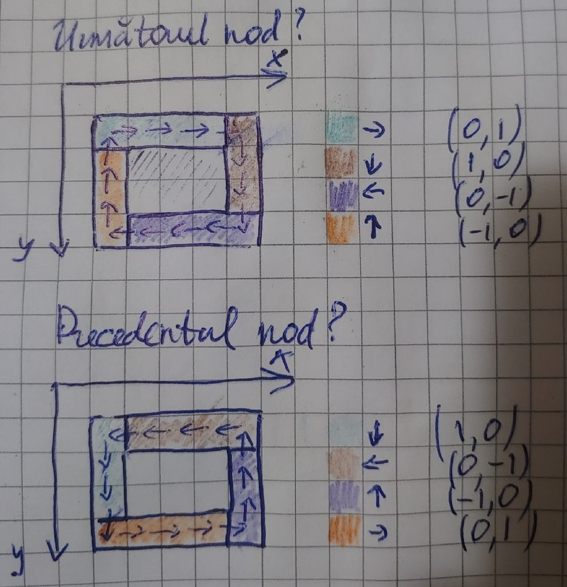

# Lucrarea de laborator nr.2 la Programarea Paralelă și Distribuită

Tema: **Transmiterea de date între procese din mediu virtual cu topologie carteziană.**

A realizat: **Curmanschii Anton, IA1901**

Vedeți [github-ul](https://github.com/AntonC9018/uni_parallel).


## Sarcina

Să se elaboreze un program cu utilizarea funcțiilor MPI pentru gestionarea grupelor 
de procese și a comunicatoarelor, care ar asigura transmiterea datelor de la un proces la altul (pe cerc) în 
direcția acelor de ceas. Procesele aparțin muchiilor unei fațete arbitrare a cubului.  
De exemplu (a se vedea desenul de mai jos), dacă se fixează fațetă laterală a cubului pentru $ x=3 $, 
atunci transmiterea de date se va realiza astfel: 

$
(3,0,0) \rightarrow  (3,1,0)  \rightarrow  (3,2,0)  \rightarrow  (3,3,0)  \rightarrow  (3,3,1)  \rightarrow  (3,3,2) \rightarrow  (3,3,3) \rightarrow \\\\ 
(3,2,3) \rightarrow  (3,1,3) \rightarrow  (3,0,3) \rightarrow (3,0,2) \rightarrow (3,0,1) \rightarrow (3,0,0)
$

## Realizarea

Deci, descriu în scurt algoritmul:

1. Procesele sunt plasate într-o topologie carteziană.
2. Se selectează aleator o axă. Se selectează aleator o fațetă prin care trece această axă. 
   Fațeta selectată va fi acea fațetă de-a lungul cărei procelese vor face schimbul de mesaje.
3. Eliminăm acele procese care nu fac parte din frontiera fațetei.
4. Celelalte procese își calculează coordonatele vecinilor: rancul nodului trecut și a nodului următor.
5. Procesele utilizează funcția `MPI_Cart_rank` pentru a afla rancul următorului și trecutului proces.
6. Procesele apelează funcția `sendrecv`, primind ceva date de la procesul trecut și trimitând ceva date procesului următor.


### Crearea topologiei

Deci, la începul toate procesele calculează dimensiunele topologiei.
Aici folosesc funcția helper `mh.getDimensions` care în rândul săl apelează `MPI_Dims_create`.

```d
int[3] dimensions; 
mh.getDimensions(info.size, dimensions[]);
if (info.rank == 0)
    writeln("Computed dimensions: ", dimensions);
```

Prin urmare tabloul `dimensions` conține numărul de procese după fiecare dimensiune.
De exemplu, pentru 64 de procese codul afișează `[4, 4, 4]`. 

Noi putem opera mai departe numai dacă cel mult o dimensiune are lungimea 1.
În alt caz nu avem un cub (suport și cazul mai general de paralelipiped), ci o linie (punct, dacă numărul de procese e 1).
Echivalent, aceasta are loc când dimensiunea este un număr prim (ori 1). 
Am putea verifica prin aceasta, însă fac mai simplu și socotesc unitățile:

```d
auto numberOfOnes = dimensions[].count(1);
mh.abortIf(numberOfOnes >= 2, "At least two of the dimensions were 1. Please select a non-prime number.");
```

Creăm topologia, apelând funcția helper `mh.createCartesianTopology` care apelează `MPI_Cart_create(MPI_COMM_WORLD, ...)` cu `reorder = false`. `dimensionsLoopAround` reprezintă parametrul `periods`, consider că acest nume este mai ușor de înțeles. 

```d
int[3] dimensionsLoopAround = 0;
MPI_Comm topologyComm = mh.createCartesianTopology(dimensions[], dimensionsLoopAround[]);
```

### Determinarea fațetei aleatoare

Luând în vedere faptul că avem nevoie de un număr generat aleator, și ca acest număr să fie cunoscut între procesele, avem două variante cum putem proceda:
* Ori generăm acest număr la fiecare proces utilizând același `seed`, care de exemplu vom primi ca parametru la consola ori să-l punem direct în cod.
* Să generăm număr aleator o dată la root și să-l distribuim tuturor proceselor, utilizând `bcast` (am ales această variantă).

Am putea genera 2 numere, un număr pentru indicele axei (x, y, z) și un boolean oare luăm coordonata maximală ori minimală.
Însă putem observa că un cub are 6 fațete, deci putem reprezenta orice fațetă print-un singur număr de la 0 la 5 inclusiv.
Dacă este par, zicem că luăm coordonata maximală, iar dacă impar, minimală (ori invers, nu contează), iar indicele axei determinăm divizând numărul generat pe 2. 

Încă avem de considerat un caz excepțional: dacă o dimensiune are lungimea 1, atunci fixăm anume această dimensiune (avem un plan pe celelalte dimensiuni, și ne vom itera pe frontiera acestuia).

```d
size_t fixedAxisIndex;
int fixedCoordinate;
// The dimension that had that one is selected
if (numberOfOnes == 1)
{
    fixedAxisIndex = dimensions[].countUntil(1);
    fixedCoordinate = 0;
}
else
{
    int sideIndex;
    if (info.rank == 0)
    {
        import std.random : uniform;
        sideIndex = uniform!uint % 6;
    }
    mh.bcast(&sideIndex, 0);
    
    // `sideIndex` will be in range [0..6]
    // for 0, 1 the axis is 0, x
    // for 2, 3 the axis is 1, y
    // for 4, 5 the axis is 2, z 
    fixedAxisIndex = sideIndex / 2;
    // Whether the side is max (or min) along fixedAxisIndex
    bool isMax = sideIndex % 2 == 0;

    fixedCoordinate = isMax ? (dimensions[fixedAxisIndex] - 1) : 0;
}

if (info.rank == 0)
    writeln("Selected fixed axis index is ", fixedAxisIndex, " with coordinate ", fixedCoordinate);

// These two will change as we walk across the edge
int[2] otherAxes = [(fixedAxisIndex + 1) % 3, (fixedAxisIndex + 2) % 3];
```

### Eliminarea proceselor care nu fac parte din fațeta

La început apelăm funcția `mh.getCartesianCoordinates` care în rândul său apelează funcția `MPI_Cart_coords`, pentru a ne afla coordonatele.

```d
int[3] mycoords;
mh.getCartesianCoordinates(topologyComm, info.rank, mycoords[]);
```

Este simplu: dacă coordonata după axa fixată nu este egală cu coordonata fixată, return.
Dacă nici o coordonată din celelalte coordonate nu este pe frontieră, return.

```d
// We only continue if we're part of that side
if (mycoords[fixedAxisIndex] != fixedCoordinate)
    return 0;

// And we must not be in the center of that side.
// We quit if none of the coords are at the edges.
if (!otherAxes[].any!(axisIndex => 
    mycoords[axisIndex] == 0 || mycoords[axisIndex] == dimensions[axisIndex] - 1))
{
    return 0;
}
```

### Calculul coordonatelor vecinilor

Aici ar fi util să ne uităm la un desen și pentru fiecare caz.



Și să suprapuneți cu codul (numai ordinea în cod este ceva diferită):

```d
int row = mycoords[otherAxes[0]];
int col = mycoords[otherAxes[1]];
int[2] otherDimsLengths = [dimensions[otherAxes[0]], dimensions[otherAxes[1]]];
int lastRowIndex = otherDimsLengths[0] - 1;
int lastColIndex = otherDimsLengths[1] - 1;

int[2] getNextDirection()
{
    if (row == 0 && col < lastColIndex)
        return [0, 1];
    if (row == lastRowIndex && col > 0)
        return [0, -1];
    if (col == 0 && row > 0)
        return [-1, 0];
    // else if (col == lastColIndex && row < lastRowIndex)
        return [1, 0];
}
int[2] getPrevDirection()
{
    if (row == 0 && col > 0)
        return [0, -1];
    if (row == lastRowIndex && col < lastColIndex)
        return [0, 1];
    if (col == 0 && row < lastRowIndex)
        return [1, 0];
    // else if (col == lastColIndex && row > 0)
        return [-1, 0];
}
```

Acum putem aplica deplasările la poziția curentă a procesului, pentru a primi poziția următorului și a procedentului proces:

```d
int[2] nextDirection = getNextDirection();
int[3] nextNodeCoords;
nextNodeCoords[fixedAxisIndex] = fixedCoordinate;
nextNodeCoords[otherAxes[0]] = row + nextDirection[0];
nextNodeCoords[otherAxes[1]] = col + nextDirection[1];

int[2] prevDirection = getPrevDirection();
int[3] prevNodeCoords;
prevNodeCoords[fixedAxisIndex] = fixedCoordinate;
prevNodeCoords[otherAxes[0]] = row + prevDirection[0];
prevNodeCoords[otherAxes[1]] = col + prevDirection[1];
```

Cel mai importantă idee aici a fost transformarea de coordonate care am executat (otherAxes).
Această transformare îmi permite să calculez poziția nodurilor vecini utilizând un singur algoritm.
De fapt, am putea să elimin a doua funcție, calculând poziția printr-o transformare de coordonate (de fapt o reflecție) aplicarea algoritmului, și transformarea inversă, dar nu necesită în acest caz.


### Calcularea rancului vecinilor

`mh.getCartesianRank` apelează `MPI_Cart_rank`.

```d
int nextRank = mh.getCartesianRank(topologyComm, nextNodeCoords[]);
int prevRank = mh.getCartesianRank(topologyComm, prevNodeCoords[]);
```

### Interschimbarea mesajelor

Fiecare proces își transmite rancul.

```d
int sentMessage = info.rank;
int receivedMessage;
mh.sendRecv(&sentMessage, nextRank, 12, &receivedMessage, prevRank, 12);

writeln(
    "Process with rank ", info.rank,
    " and coordinates ", mycoords, 
    " sent message ", sentMessage, 
    " to process ", nextRank,
    " at coordinates ", nextNodeCoords,
    " and received ", receivedMessage, 
    " from ", prevRank,
    " at coordinates ", prevNodeCoords);
```


## Executarea

Cel mai simplu caz ar fi pentru un cub cu dimensiunile $ 2 \times 2 \times 2 $.
În acest caz am aștepta, de exemplu, interschimbările
$ (0, 0, 0) \rightarrow (0, 1, 0) \rightarrow (1, 1, 0) \rightarrow (1, 0, 0) \rightarrow (0, 0, 0) $
pentru latura după axa $ 0 $ fixată la $ 0 $.

Pentru următoarea executare indicele fixat a fost $ 2 $.
```
$ ./compile.sh lab2
$ mpirun -np 8 -host "compute-0-0" lab2.out
Computed dimensions: [2, 2, 2]
Selected fixed axis index is 2 with coordinate 0
Process with rank 2 and coordinates [0, 1, 0] sent message 2 to process 6 at coordinates [1, 1, 0] and received 0 from 0 at coordinates [0, 0, 0]
Process with rank 6 and coordinates [1, 1, 0] sent message 6 to process 4 at coordinates [1, 0, 0] and received 2 from 2 at coordinates [0, 1, 0]
Process with rank 4 and coordinates [1, 0, 0] sent message 4 to process 0 at coordinates [0, 0, 0] and received 6 from 6 at coordinates [1, 1, 0]
Process with rank 0 and coordinates [0, 0, 0] sent message 0 to process 2 at coordinates [0, 1, 0] and received 4 from 4 at coordinates [1, 0, 0]
```

Încercăm un paralelipiped:

```d
$ mpirun -np 16 -host "compute-0-0,compute-0-1" lab2.out
Computed dimensions: [4, 2, 2]
Selected fixed axis index is 0 with coordinate 3
Process with rank 12 and coordinates [3, 0, 0] sent message 12 to process 13 at coordinates [3, 0, 1] and received 14 from 14 at coordinates [3, 1, 0]
Process with rank 13 and coordinates [3, 0, 1] sent message 13 to process 15 at coordinates [3, 1, 1] and received 12 from 12 at coordinates [3, 0, 0]
Process with rank 15 and coordinates [3, 1, 1] sent message 15 to process 14 at coordinates [3, 1, 0] and received 13 from 13 at coordinates [3, 0, 1]
Process with rank 14 and coordinates [3, 1, 0] sent message 14 to process 12 at coordinates [3, 0, 0] and received 15 from 15 at coordinates [3, 1, 1]
$ mpirun -np 16 -host "compute-0-0,compute-0-1" lab2.out
Computed dimensions: [4, 2, 2]
Selected fixed axis index is 2 with coordinate 1
Process with rank 5 and coordinates [1, 0, 1] sent message 5 to process 1 at coordinates [0, 0, 1] and received 9 from 9 at coordinates [2, 0, 1]
Process with rank 9 and coordinates [2, 0, 1] sent message 9 to process 5 at coordinates [1, 0, 1] and received 13 from 13 at coordinates [3, 0, 1]
Process with rank 1 and coordinates [0, 0, 1] sent message 1 to process 3 at coordinates [0, 1, 1] and received 5 from 5 at coordinates [1, 0, 1]
Process with rank 3 and coordinates [0, 1, 1] sent message 3 to process 7 at coordinates [1, 1, 1] and received 1 from 1 at coordinates [0, 0, 1]
Process with rank 7 and coordinates [1, 1, 1] sent message 7 to process 11 at coordinates [2, 1, 1] and received 3 from 3 at coordinates [0, 1, 1]
Process with rank 11 and coordinates [2, 1, 1] sent message 11 to process 15 at coordinates [3, 1, 1] and received 7 from 7 at coordinates [1, 1, 1]
Process with rank 15 and coordinates [3, 1, 1] sent message 15 to process 13 at coordinates [3, 0, 1] and received 11 from 11 at coordinates [2, 1, 1]
Process with rank 13 and coordinates [3, 0, 1] sent message 13 to process 9 at coordinates [2, 0, 1] and received 15 from 15 at coordinates [3, 1, 1]
```

Dacă încercăm un număr prim, cum așteptat, programul se termină.
```d
$ mpirun -np 7 -host "compute-0-0,compute-0-1" lab2.out
The process has been aborted: At least two of the dimensions were 1. Please select a non-prime number.

... mesajele de erori ale lui MPI ...

```

Un cub $ 4 \times 4 \times 4 $:

```
$ mpirun -np 64 -host "compute-0-0,compute-0-1,compute-0-2" lab2.out
Computed dimensions: [4, 4, 4]
Selected fixed axis index is 1 with coordinate 0
Process with rank 48 and coordinates [3, 0, 0] sent message 48 to process 49 at coordinates [3, 0, 1] and received 32 from 32 at coordinates [2, 0, 0]
Process with rank 19 and coordinates [1, 0, 3] sent message 19 to process 3 at coordinates [0, 0, 3] and received 35 from 35 at coordinates [2, 0, 3]
Process with rank 16 and coordinates [1, 0, 0] sent message 16 to process 32 at coordinates [2, 0, 0] and received 0 from 0 at coordinates [0, 0, 0]
Process with rank 32 and coordinates [2, 0, 0] sent message 32 to process 48 at coordinates [3, 0, 0] and received 16 from 16 at coordinates [1, 0, 0]
Process with rank 2 and coordinates [0, 0, 2] sent message 2 to process 1 at coordinates [0, 0, 1] and received 3 from 3 at coordinates [0, 0, 3]
Process with rank 1 and coordinates [0, 0, 1] sent message 1 to process 0 at coordinates [0, 0, 0] and received 2 from 2 at coordinates [0, 0, 2]
Process with rank 3 and coordinates [0, 0, 3] sent message 3 to process 2 at coordinates [0, 0, 2] and received 19 from 19 at coordinates [1, 0, 3]
Process with rank 51 and coordinates [3, 0, 3] sent message 51 to process 35 at coordinates [2, 0, 3] and received 50 from 50 at coordinates [3, 0, 2]
Process with rank 35 and coordinates [2, 0, 3] sent message 35 to process 19 at coordinates [1, 0, 3] and received 51 from 51 at coordinates [3, 0, 3]
Process with rank 49 and coordinates [3, 0, 1] sent message 49 to process 50 at coordinates [3, 0, 2] and received 48 from 48 at coordinates [3, 0, 0]
Process with rank 50 and coordinates [3, 0, 2] sent message 50 to process 51 at coordinates [3, 0, 3] and received 49 from 49 at coordinates [3, 0, 1]
Process with rank 0 and coordinates [0, 0, 0] sent message 0 to process 16 at coordinates [1, 0, 0] and received 1 from 1 at coordinates [0, 0, 1]
```

## Întregul cod

Vedeți [github](https://github.com/AntonC9018/uni_parallel/blob/95f998152788396c5360766d54466966bef77837/source/lab2.d).