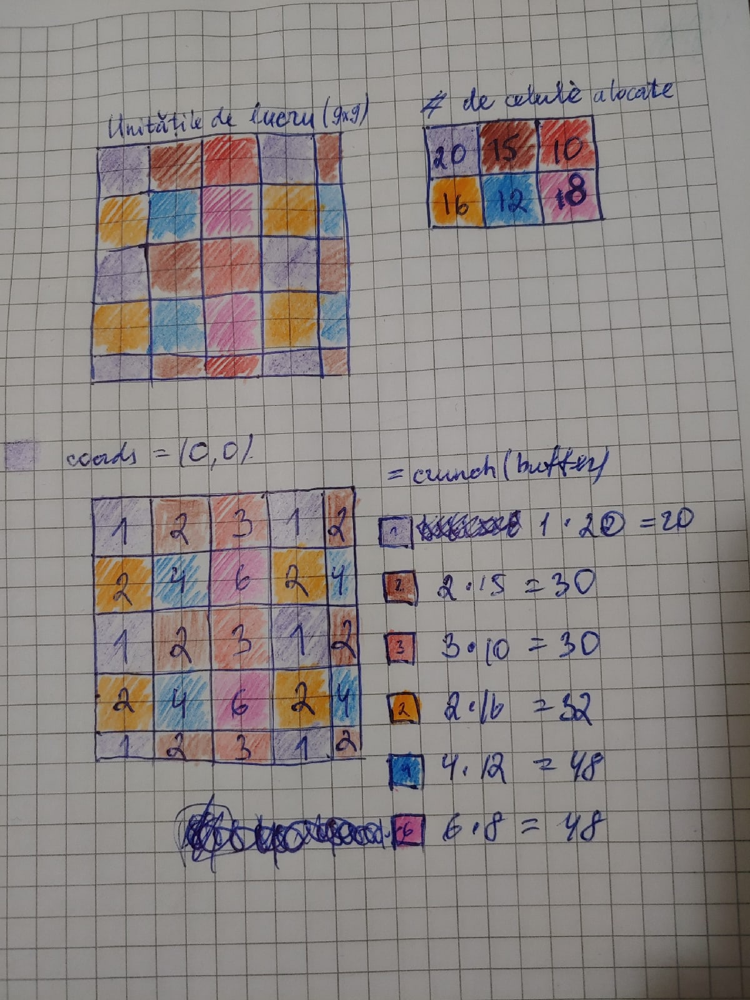

# Lucrarea de laborator nr.3 la Programarea Paralelă și Distribuită

Tema: **Divizarea și distribuirea matricelor pe grille de procese utilizând algoritmul 2D-ciclic.**

A realizat: **Curmanschii Anton, IA1901**

Vedeți [github-ul](https://github.com/AntonC9018/uni_parallel).


## Sarcina

Să se elaboreze un program pentru gestionarea grupelor de procese și a cominicatoarelor 
în care să se realizeze următoarele: 
* un mediul de comunicare care corespunde unei grile doi-dimensionale de procese;
* inițializarea cu valori aleatoare a unei matrice de către root 
  și distribuirea pe procesele din grila de procese aceasta matrice în baza algoritmului 2D-ciclic.


## Introducere

Desenul de mai jos ilustrează ideea. Lucrul (din matricea din stânga) este distribuit proceselor (din grila din dreapta) conform culorilor. Fiecare pătrat mare este un bloc de lucru, fiecare pătrățel este o unitate de lucru (o celulă). Mai jos blocurile de lucru au fost atribuite valori (numărul este copiat în fiecare celulă), iar procesele au calculat (crunch) rezultatul computații (în acest caz, suma $=$ valoarea în fiecare celulă $\times$ numărul de celule). 




## Realizarea

Descriu în scurt algoritmul:

1. Se inițializează grila de procese.
2. Se inițializează (aleator) o matrice. Am realizat două versiuni a programului: una cu inițializarea la root, alta cu inițializarea virtuală (falsă, adică nu se crează matricea, însă valorile se distribuie).
3. Fiecare proces își alocă buferul pentru primirea valorilor de la root.
4. Fiecare proces într-un mod își primește valorile din matrice de la root.
5. Fiecare proces își calculează și afișează rezultatul computației (de exemplu, sumarea valorilor sale din matrice).


Am realizat mai multe versiuni ale programului. 
Care versiune anume s-ar compila se determină prin utilizarea flagurilor `version`.

* Default. Dacă nu dați nici un flag, matricea va avea o dimensiune arbitrară, 
  unde fiecare marime este cel puțin o sută și ele sumează la 1000.
  Valorile sunt distribuite "fals", adică matricea niciodată nu există în întregime în memorie contiguă.
  Celulile primesc valori aleatorii din intervalul $ [ 1, 5 ] $.
  Mărimea blocului este aleatoare din intervalul $ [ 2, 17 ] $. 
* `-version=SimpleTest`. Fixează dimensiunile grilei de computație la $ (2, 3) $, 
  dimensiunile matricei de valori la $ (9, 9) $, mărimea blocului la $ 2 $.
  Inițializează matricea cu unele valori ușoare de verificat (dacă nu este dat următorul flag).
* `-version=WithActualMatrix`. Inițializează întreaga matrice la root. 
  Datele se transmită utilizând funcțiile RMA.

Versiunile `SimpleTest` și `WithActualMatrix` sunt compatibile între sine.


### Crearea topologiei

Codul de inițializare este simplu. 
Deja am explicat funcțiile utilizate pentru crearea topologiei în lucrarea de laborator 2.

`enum NUM_DIMS = 2;` aici este ceva echivalent cu `#define NUM_DIMS 2` în C.
Am făcut așa, ca algoritmul să poată fi transformat într-un algoritm mai general pentru N dimensiuni (fără a pierde generalitatea).
Cum veți vedea mai departe, operațiile pe tablouri din D simplifică codul în unele locuri, fiind folosite în locul ciclurilor.

```d
enum NUM_DIMS = 2;

int[NUM_DIMS] computeGridDimensions = 0; 
version (SimpleTest)
{
    mh.abortIf(info.size != 6, "The number of processes for the simple case must be 6.");
    computeGridDimensions = [2, 3];
}
else
{
    mh.getDimensions(info.size, computeGridDimensions[]);
}
int[NUM_DIMS] repeats = 0;
MPI_Comm topologyComm = mh.createCartesianTopology(computeGridDimensions[], repeats[]);
int[NUM_DIMS] mycoords = void;
mh.getCartesianCoordinates(topologyComm, info.rank, mycoords[]);
// We have passed reorder = false.
int rootRankInComputeGrid = 0;
int myComputeRank = info.rank;
```

### Inițializarea matricei

Cum s-a menționat anterior, matricea este de fapt inițializată la root numai dacă dați flagul `-version=WithActualMatrix` la compilare.

`matrixDimensions.fold!`a * b`(1)` calculează produsul tuturor elementelor (de fapt se face `1 * matrixDimensions[0] * matrixDimensions[1]`).

```d
int[NUM_DIMS] matrixDimensions;
version (SimpleTest)
{
    matrixDimensions = [9, 9];
}
else
{
    if (info.rank == 0)
        matrixDimensions[0] = uniform!uint % 800 + 100;
    mh.bcast(&matrixDimensions[0], 0);
    matrixDimensions[1] = 1000 - matrixDimensions[0];
}

version (WithActualMatrix)
{
    int[] matrixData;
    if (myComputeRank == rootRankInComputeGrid)
    {
        matrixData = new int[](matrixDimensions.fold!`a * b`(1));
        foreach (ref element; matrixData)
            element = uniform!uint % 5 + 1;
    }
}

int blockSize;
version (SimpleTest)
{
    blockSize = 2;
}
else
{
    if (info.rank == 0)
        blockSize = uniform!uint % 16 + 2;
    mh.bcast(&blockSize, 0);
}

if (info.rank == 0)
{
    writeln("Compute grid dimensions: ", computeGridDimensions);
    writeln("Matrix dimensions: ", matrixDimensions);
    writeln("Block size: ", blockSize);
}
```

Pentru inițializarea falsă a datelor concrete din matrice pe urmă se va folosi care se va apărea pe urmă.


### Alocarea buferului

Am realizat o funcție ce calculează câte elemente un proces pe coordonate date ar primi.
Ea necesită unele valori intermediare, pe care le calculez înainte de a apela funcția.

Voi explica o linie din cod ce folosește operații pe tablouri.
```d
// Ceiling. Includes the last block.
int[NUM_DIMS] blockCounts = (matrixDimensions[] + blockSize - 1) / blockSize;
```
Notația `matrixDimensions[]` înseamnă "faceți aceasta cu fiecare element din matrixDimensions".

Deci linia aceasta de cod tradusă în C ar fi asemănătoare cu următoarea:
```C
int[NUM_DIMS] blockCounts;
for (int i = 0; i < NUM_DIMS; i++)
    blockCounts[i] = (matrixDimensions[i] + blockSize - 1) / blockSize;
```

Funcția `getWorkSizeForProcessAt` returnează de fapt valorile din dreapta din diagrama anterioară, pentru un anumit proces.

```d
// Ceiling. Includes the last block.
int[NUM_DIMS] blockCounts = (matrixDimensions[] + blockSize - 1) / blockSize;
// Last column or row may be incomplete
int[NUM_DIMS] lastBlockSizes = matrixDimensions[] % blockSize;
int[NUM_DIMS] wholeBlockCountsPerProcess = matrixDimensions[] / (blockSize * computeGridDimensions[]);
int[NUM_DIMS] blockIndicesOfLastProcess = blockCounts[] - wholeBlockCountsPerProcess[] * computeGridDimensions[] - 1;

int getWorkSizeForProcessAt(int[NUM_DIMS] coords)
{
    int workSize = 1;
    foreach (dimIndex, wholeBlocksCount; wholeBlockCountsPerProcess)
    {
        int dimWorkSize = wholeBlocksCount * blockSize;

        // Check if the last block is ours
        // Say there are 10 blocks and 4 processes:
        // [][][][][][][][][][]  ()()()()
        // Every process gets 2 blocks each, 2 more blocks remain:
        // [][] ()()()()
        // So if we subtract 10 - 8 we get 2, 
        // and the second process gets the last block.
        // The other processes that are to the right of it essentially get one less block.
        int index = blockIndicesOfLastProcess[dimIndex];
        if (coords[dimIndex] < index)
        {
            dimWorkSize += blockSize;
        }
        else if (coords[dimIndex] == index)
        {
            dimWorkSize += lastBlockSizes[dimIndex];
        }

        workSize *= dimWorkSize;
    }
    return workSize;
}
```

Dacă are loc distribuire valorilor "falsă", root-ul alocă un bufer maximal (deoarece îl va umpla cu valorile de transmis), iar celelalte procese alocă un bufer pentru primirea datelor.

```d
// At root, we allocate the max possible buffer.
// The first process in the compute grid will always have most load.
// Since the root always distributes, it must be able to handle a buffer of that size too.
int[NUM_DIMS] targetProcessCoords = mycoords;
if (myComputeRank == rootRankInComputeGrid) 
    targetProcessCoords = 0;
int[] buffer = new int[](getWorkSizeForProcessAt(targetProcessCoords));
```

În cazul în care procesul root alocă întreagă matrice, fiecare proces își alocă buferul într-un mod simetric.

```d
int[] buffer = new int[](getWorkSizeForProcessAt(mycoords));
```


### Distribuirea valorilor

În cazul distibuirii "false", procesul root calculează câți numere celălalt proces trebuie să primească, și își umplă buferul cu atât număr de numeri aleatorii, după ce are loc transmiterea datelor.
Celelalte procese pur și simplu primesc valori de la root.

```d
// We will send the buffers individually to each process.
const tag = 10;
if (myComputeRank == rootRankInComputeGrid)
{
    // This function may have arbitrary logic.
    // Currently, just fill the buffer with sane random numbers.
    static void prepareBuffer(int[] buffer, int[NUM_DIMS] coords)
    {
        foreach (ref item; buffer)
            version (SimpleTest)
                item = (coords[0] + 1) * (coords[1] + 1);
            else
                item = uniform!uint % 5 + 1;
    }

    // Another idea is to check out all coords
    // foreach (int[NUM_DIMS] coords; nDimensionalIndices(computeGridDimensions))
    // {
    //     if (coords == mycoords)
    //         continue;
    //     int destRank = mh.getCartesianRank(topologyComm, coords[]);

    // Implement the simpler idea: iterating over ranks rather than coords.
    foreach (int destRank; 0..info.size)
    {
        if (destRank == rootRankInComputeGrid)
            continue;
        int[NUM_DIMS] coords;
        mh.getCartesianCoordinates(topologyComm, destRank, coords[]);
        int[] sendBuffer = buffer[0..getWorkSizeForProcessAt(coords)];
        prepareBuffer(sendBuffer, coords);
        mh.send(sendBuffer, destRank, tag, topologyComm);
    }
    // Prepare own share.
    prepareBuffer(buffer, mycoords);
}
else
{
    mh.recv(buffer, rootRankInComputeGrid, tag, MPI_STATUS_IGNORE, topologyComm);
}
```

În cazul în care se folosește o matrice reală, folosesc RMA. Procesul root își expune buferul, iar celelalte procese își calculează indicii de pe care se vor lua valori și le solicită într-un ciclu.

Unele explicații:
* `mh.MemoryWindow`, `matrixWindow.free`, `mh.createMemoryWindow`, `mh.acquireMemoryWindow`, `matrixWindow.get` sunt evident wrapper-urile mele care înțeleg sistemul de tipuri în D. Ele utilizează funcții MPI în implementare.
* `foreach (int i; iota(a, b, step))` substituie `for (int i = a; i < b; i += step)`. Folosesc `iota`, deoarece atunci n-am nevoie să repet `rowIndex` de trei ori în `for`.
* Primul argument în `matrixWindow.get` are informația câte biți să luăm (`colRecvSize`) și pe care poziție în bufer de ieșire să le punem (`bufferIndex`). `linearIndexInMatrix` semnifică poziția în matrice.
* `assert(bufferIndex == buffer.length)` ne asigură că am copiat un număr de valori corect.

> Această parte de algoritm este legată cu numărul de dimensiuni al matricei (avem DOUĂ cicluri imbricate, și mai un ciclu pentru rânduri). 
> Trebuie să generalizez $ N $ cicluri `for` imbricate și $ N - 1 $ cicluri cu minimum imbricate, ca să ating aceasta.
> Eu cunosc algoritmul pentru aceasta, care deja într-un mod mai simplu l-am realizat în funcția `nDimensionalIndices` (se duce de la 0 la N, adică nu are aceste limite ca la `iota`).
> Însă pentru așa ceva ar fi probabil mai bine să utilizez o librărie.

```d
// Let's make use of RMA, because it's neat.
mh.MemoryWindow!int matrixWindow;
scope(exit) matrixWindow.free();
if (myComputeRank == rootRankInComputeGrid)
    matrixWindow = mh.createMemoryWindow(matrixData, MPI_INFO_NULL, topologyComm);
else
    matrixWindow = mh.acquireMemoryWindow!int(MPI_INFO_NULL, topologyComm);


matrixWindow.fence();

size_t bufferIndex = 0;
foreach (int rowIndex; iota(mycoords[0] * blockSize, matrixDimensions[0], computeGridDimensions[0] * blockSize))
foreach (int colIndex; iota(mycoords[1] * blockSize, matrixDimensions[1], computeGridDimensions[1] * blockSize))
foreach (int actualRowIndex; rowIndex..min(rowIndex + blockSize, matrixDimensions[0]))
{
    int colRecvSize = min(blockSize, matrixDimensions[1] - colIndex);
    int linearIndexInMatrix = actualRowIndex * blockSize + colIndex;
    matrixWindow.get(
        buffer[bufferIndex .. bufferIndex += colRecvSize], 
        linearIndexInMatrix, rootRankInComputeGrid);
}
assert(bufferIndex == buffer.length);

matrixWindow.fence();
```


### Calculul și rezultatele

Calculăm suma tuturor elementelor din bufer.
Funcția poate fi modificată la orice operație doriți.

```d
// The random computation that each process has to do.
static int crunch(int[] buf)
{
    // return buf.fold!`a * b`(1);
    return buf.fold!`a + b`(0);
}
int result = crunch(buffer);

writeln(
    "Process ", info.rank,
    " at coordinates ", mycoords,
    " received ", buffer.length, " items.",
    " The crunched amount came out to ", result);
```

## Executarea

```
$ ./compile.sh lab3 -version=SimpleTest
$ mpirun -np 6 -host "compute-0-0" lab3.out
Compute grid dimensions: [2, 3]
Matrix dimensions: [9, 9]
Block size: 2
Process 0 at coordinates [0, 0] received 20 items. The crunched amount came out to 20
Process 3 at coordinates [1, 0] received 16 items. The crunched amount came out to 32
Process 4 at coordinates [1, 1] received 12 items. The crunched amount came out to 48
Process 2 at coordinates [0, 2] received 10 items. The crunched amount came out to 30
Process 1 at coordinates [0, 1] received 15 items. The crunched amount came out to 30
Process 5 at coordinates [1, 2] received 8 items. The crunched amount came out to 48

$ ./compile.sh lab3 -version=SimpleTest -version=WithActualMatrix
$ mpirun -np 6 -host "compute-0-0" lab3.out
Compute grid dimensions: [2, 3]
Matrix dimensions: [9, 9]
Block size: 2
Process 2 at coordinates [0, 2] received 10 items. The crunched amount came out to 36
Process 3 at coordinates [1, 0] received 16 items. The crunched amount came out to 54
Process 4 at coordinates [1, 1] received 12 items. The crunched amount came out to 42
Process 1 at coordinates [0, 1] received 15 items. The crunched amount came out to 38
Process 5 at coordinates [1, 2] received 8 items. The crunched amount came out to 18
Process 0 at coordinates [0, 0] received 20 items. The crunched amount came out to 61

$ ./compile.sh lab3 -version=WithActualMatrix
$ mpirun -np 16 -host "compute-0-0,compute-0-1,compute-0-2" lab3.out
Compute grid dimensions: [4, 4]
Matrix dimensions: [872, 128]
Block size: 7
Process 8 at coordinates [2, 0] received 7595 items. The crunched amount came out to 22811
Process 4 at coordinates [1, 0] received 7595 items. The crunched amount came out to 22780
Process 11 at coordinates [2, 3] received 6076 items. The crunched amount came out to 18365
Process 14 at coordinates [3, 2] received 6510 items. The crunched amount came out to 19805
Process 13 at coordinates [3, 1] received 7595 items. The crunched amount came out to 23034
Process 5 at coordinates [1, 1] received 7595 items. The crunched amount came out to 22789
Process 7 at coordinates [1, 3] received 6076 items. The crunched amount came out to 18191
Process 10 at coordinates [2, 2] received 6510 items. The crunched amount came out to 19630
Process 1 at coordinates [0, 1] received 7735 items. The crunched amount came out to 23233
Process 2 at coordinates [0, 2] received 6630 items. The crunched amount came out to 19910
Process 15 at coordinates [3, 3] received 6076 items. The crunched amount came out to 18364
Process 6 at coordinates [1, 2] received 6510 items. The crunched amount came out to 19543
Process 3 at coordinates [0, 3] received 6188 items. The crunched amount came out to 18576
Process 12 at coordinates [3, 0] received 7595 items. The crunched amount came out to 23062
Process 9 at coordinates [2, 1] received 7595 items. The crunched amount came out to 22827
Process 0 at coordinates [0, 0] received 7735 items. The crunched amount came out to 23222
```

Putem verifica, sumând toate valorile și asigurându-ne că este egal cu numărul de elemente în matrice:
```d
int[] t = [
    7595, 7595, 6076, 6510, 7595,
    7595, 6076, 6510, 7735, 6630,
    6076, 6510, 6188, 7595, 7595, 7735];
int a = t.fold!`a + b`(0);
int b = 872 * 128;
writeln(a, " ", a == b); // 111616 true
```

```
$ ./compile.sh lab3
$ mpirun -np 16 -host "compute-0-0,compute-0-1,compute-0-2" lab3.out
Compute grid dimensions: [4, 4]
Matrix dimensions: [452, 548]
Block size: 7
Process 2 at coordinates [0, 2] received 15660 items. The crunched amount came out to 47088
Process 1 at coordinates [0, 1] received 16240 items. The crunched amount came out to 48635
Process 3 at coordinates [0, 3] received 15428 items. The crunched amount came out to 46561
Process 4 at coordinates [1, 0] received 15680 items. The crunched amount came out to 47337
Process 5 at coordinates [1, 1] received 15680 items. The crunched amount came out to 47082
Process 6 at coordinates [1, 2] received 15120 items. The crunched amount came out to 45387
Process 8 at coordinates [2, 0] received 15680 items. The crunched amount came out to 46892
Process 7 at coordinates [1, 3] received 14896 items. The crunched amount came out to 44524
Process 9 at coordinates [2, 1] received 15680 items. The crunched amount came out to 47032
Process 10 at coordinates [2, 2] received 15120 items. The crunched amount came out to 45516
Process 11 at coordinates [2, 3] received 14896 items. The crunched amount came out to 44760
Process 12 at coordinates [3, 0] received 15680 items. The crunched amount came out to 47036
Process 13 at coordinates [3, 1] received 15680 items. The crunched amount came out to 47017
Process 14 at coordinates [3, 2] received 15120 items. The crunched amount came out to 45261
Process 15 at coordinates [3, 3] received 14896 items. The crunched amount came out to 45027
Process 0 at coordinates [0, 0] received 16240 items. The crunched amount came out to 48593
```

Verificăm suma: `248775 true`.

```
$ mpirun -np 3 -host "compute-0-0,compute-0-1,compute-0-2" lab3.out
Compute grid dimensions: [3, 1]
Matrix dimensions: [519, 481]
Block size: 6
Process 1 at coordinates [1, 0] received 83694 items. The crunched amount came out to 251542
Process 2 at coordinates [2, 0] received 82251 items. The crunched amount came out to 247146
Process 0 at coordinates [0, 0] received 83694 items. The crunched amount came out to 251498
```

`249639 true`.

```
$ ./compile.sh lab3 -version=WithActualMatrix
$ mpirun -np 3 -host "compute-0-0,compute-0-1,compute-0-2" lab3.out
Compute grid dimensions: [3, 1]
Matrix dimensions: [152, 848]
Block size: 15
Process 2 at coordinates [2, 0] received 38160 items. The crunched amount came out to 114969
Process 0 at coordinates [0, 0] received 50880 items. The crunched amount came out to 151980
Process 1 at coordinates [1, 0] received 39856 items. The crunched amount came out to 119829
```

`128896 true`

## Întregul cod

Vedeți [github](https://github.com/AntonC9018/uni_parallel/blob/95f998152788396c5360766d54466966bef77837/source/lab2.d).