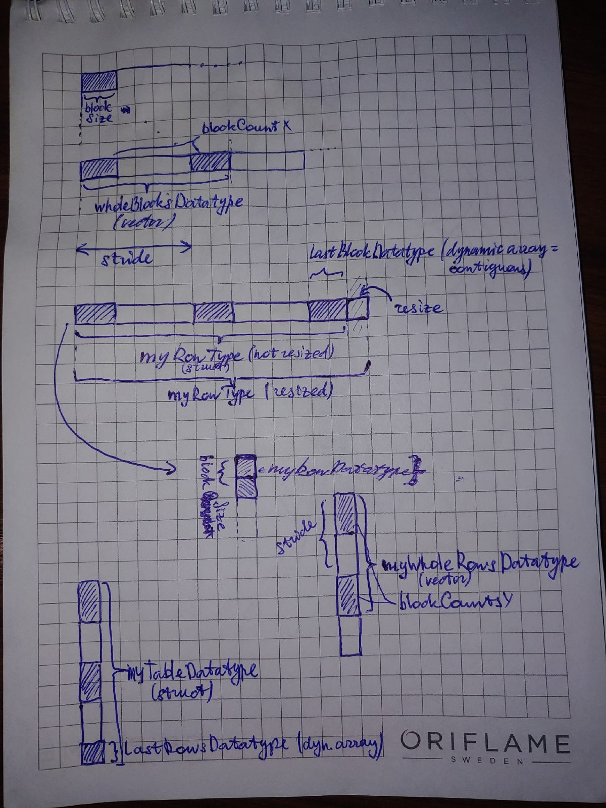
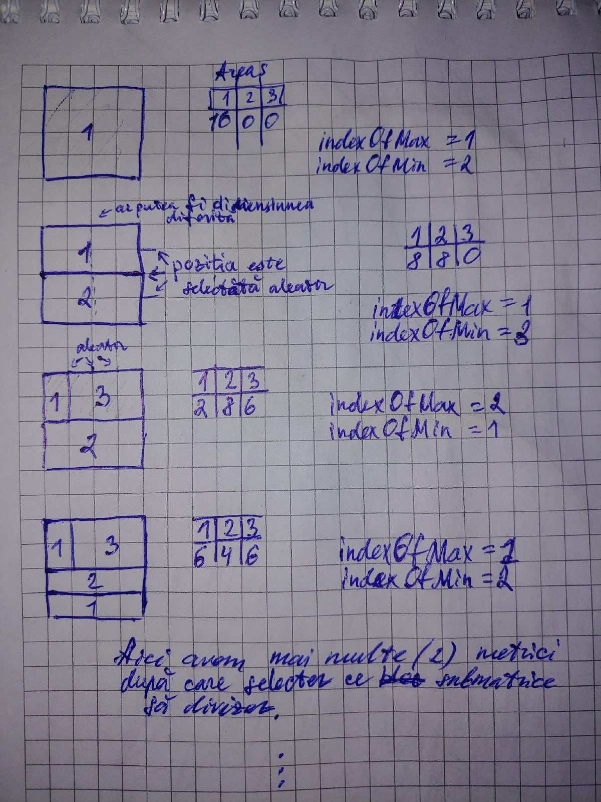
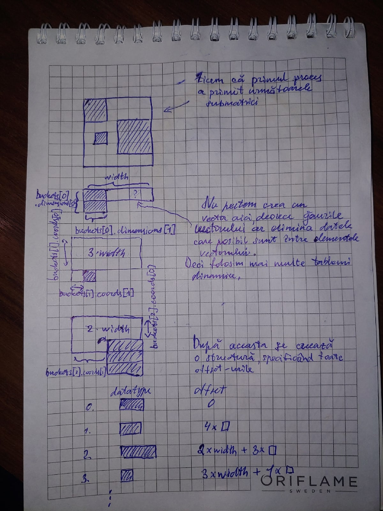

# Lucrarea de laborator nr.4 la Programarea Paralelă și Distribuită

Tema: **Utilizarea fișierelor MPI pentru prelucrarea paralelă a datelor structurate in forma unor tabele de dimensiuni foarte mari.**

A realizat: **Curmanschii Anton, IA1901**

Vedeți [github-ul](https://github.com/AntonC9018/uni_parallel).

**Tabelul de conținut**:
- [Lucrarea de laborator nr.4 la Programarea Paralelă și Distribuită](#lucrarea-de-laborator-nr4-la-programarea-paralelă-și-distribuită)
  - [Sarcina](#sarcina)
  - [Scopul lucrării](#scopul-lucrării)
  - [Tipurile de date la divizare matricei](#tipurile-de-date-la-divizare-matricei)
    - [Algoritmul 2D ciclic](#algoritmul-2d-ciclic)
    - [Distribuirea aleatoare](#distribuirea-aleatoare)
  - [Divizarea proceselor în două grupuri (și topologii)](#divizarea-proceselor-în-două-grupuri-și-topologii)
  - [Citirea (scrierea) datelor din (în) fișier](#citirea-scrierea-datelor-din-în-fișier)
  - [Întregul cod](#întregul-cod)
  - [Executarea](#executarea)
    - [Ciclic](#ciclic)
    - [Aleator](#aleator)

## Sarcina

Fie dată o matrice $ A = {|| a _ {ij} ||} ^ {i = 1, m} _ {j = 1, n} $ 
care este divizată în blocuri $ A_{kp} $ de dimensiunea $ m_k \times n_p $. 
Să se  elaboreze şi să se execute un program în care fiecare proces cu coordonatele
$ (k, p) $ dintr-un comunicator cu topologie carteziană inițializează cu valori aleatorii 
matricea $ A_{kp} $ și înscrie înntr-un fișier submatricea $ A_{kp} $. 
Dupa aceasta un alt grup de procese cu coordonatele $ (\tilde{k}, \tilde{p}) $
dintr-un comunicator cu topologie carteziană, citește din fișierul creat submatricea $ A _ { \tilde{k} \tilde{p} } $
și determină elementul maximal al matricei pe care îl trimite procesului root, care la rândul său va  
determina elementul maximal al integii matrici. Să se elaboreze un program MPI in care: 

* Matricea $ A $ se divizează în submatrici utilizând algoritmul 2D-ciclic.
* Matricea $ A $ se divizează în submatrici în mod arbitrar.


## Scopul lucrării

Lucrarea de laborator esențial este focusată pe următoarele două lucruri:

* Crearea tipurilor de date în MPI;
* Lucrul cu fișierele în MPI.

Sună simplu, însă tipurile de date în MPI au ciudățeniile lor și au fost grele de creat și de fixat erorile legate la ele.
De exemplu, funcția `MPI_Type_create_struct` așteptă ca tabloul cu deplasările să fie sortat, cu toate că nu am văzut aceasta menționat nici în specificația (dar este posibil că am omis).
De exemplu funcția `MPI_Type_create_vector` va crea un tip de date invalid, dacă îi dați zero ca numărul de blocuri, însă aceasta nu v-ar da erori. Cel mult veți avea un segmentation fault când încercați să-l utilizați.

Fișierele nu dau erori bune dacă faceți ceva incorect. Vă dau un segmentation fault, și descurcați-vă singuri.
Nu a fost clar pentru mine dacă unele funcții acceptă offset-uri în tipul de date elementar, ori în octeți;
oare la citire trebuie să specific numărul de elemente în bufer, sau numărul în tipul de date dat al fișierului (`ftype`).
Aceste lucruri am aflat deja încercând diferite lucruri aparte, și uitându-mă dacă primesc un segmentation fault în urma operațiilor.

Deoarece MPI este scrisă în C, este foarte ușor să faceți greșeli neobservate, și MPI practic nu vă oprească și rar sugerează care este problema. 
De aceea pentru toate funcțiile care le utilizez în codul final, am făcut wrapper-uri siguri de tip, care recunosc unele greșeli comune în timpul compilării, datorită sistemului de tipuri și al introspecției tipurilor în timpul compilării în D.


## Tipurile de date la divizare matricei

Aici prin imagini descriu cum formez tipurile de date utilizate la comunicare prin intermediul fișierului.

### Algoritmul 2D ciclic



Explicații mai detaliate:

* Utilizez `MPI_Type_create_vector(blockSize, blockCount = wholeBlocksPerProcess, stride = blockSize * numProcessesX)` pentru a crea tipul de date ce conține numărul de blocuri întregi destinate fiecărui proces (nu include ultimul bloc).
  De exemplu, în cazul de pe imagine, `blockSize = 2, wholeBlockPerProcess = 2, numProcessesX = 3`.
  De menționat, că vectorul creat astfel nu conține găuri după ultimul element.

* Utilizez `MPI_Type_contiguous(lastBlockSize)` pentru a crea tipul de date pentru ultimul bloc.
  De menționat, că este arătat punctul de vedere al primului proces, unde `lastBlockSize = 2`. 
  Al doilea proces va avea `lastBlockSize = 1`, iar al treilea `lastBlockSize = 0`.
  Tipurile contigue unde numărul de elemente este 0 sunt după experiența mea invalide, de aceea aici trebuie să adaugăm acest tip la vectorul nostru numai dacă `lastBlockSize > 0`.

* Concatenez vectorul și tabloul dinamic utilizând `MPI_Type_create_struct(datatypes = [wholeBlocksDatatype, lastBlockDatatype], displacements = [0, lungimea wholeBlocksDatatype + gaura după el], blockLengths = [1, 1])`.

* Aceasta însă nu ne dă necesar un tip de date de lungimea unei linii. 
  Folosim funcția `MPI_Type_resize(myRowDatatype, lungimea unei linii)` pentru a primi un tip de date de lungimea corectă.

* Asemănător facem pentru cealaltă dimensiune, pentru a obține un tip de date pentru întregul tablou.
  De menționat că acest tip de date terminal nu trebuie să fie redimensionat la numărul de elemente în matrice (pur și simplu nu contează).

De menționat încă faptul că tipurile de date nu sunt deplasate în timpul creării, ci în timpul setării tipului de date al fișierului cu
`MPI_File_set_view`. Rezultatul va fi de fapt echivalent, însă deplasarea întregului tip deoadată este mai comodă din punct de vedere calculărilor matematice.

În cod, cu utilizarea wrapper-urilor mele, arată astfel.

> Notez verificarea numărului de blocuri întregi.
> Fac astfel, deoarece în alt caz codul va deveni prea complicat din cauza multiplelor cazurilor excepționale.
> Am decis să iau ruta codului mai simplu. 

```d
version (CyclicInitialization)
{
    // Create the datatype used for interpreting the file
    auto layoutInfo = mh.getCyclicLayoutInfo(matrixDimensions, computeGridDimensions, blockSize);
    int[2] blockStrides = blockSize * computeGridDimensions[];

    foreach (dimIndex, numWholeBlocks; layoutInfo.wholeBlockCountsPerProcess)
    {
        import std.format;
        mh.abortIf(numWholeBlocks == 0, 
            "Please select a higher dimension %s of the matrix. 
            The program does not support the case when there is not at least 1 whole block per each process."
                .format(dimIndex == 0 ? "Y" : "X"));
    }

    // All blocks but the last.
    auto wholeBlocksDatatype = mh.createVectorDatatype!int(
        blockSize, layoutInfo.wholeBlockCountsPerProcess[1], blockStrides[1]);
    auto myRowType = wholeBlocksDatatype;
    
    // Variable size, because it may not fit completely into the matrix.
    auto lastBlockSize1 = layoutInfo.getLastBlockSizeAtDimension(1, mycoords[1]);
    if (lastBlockSize1 > 0)
    {
        auto lastBlockDatatype = mh.createDynamicArrayDatatype!int(lastBlockSize1);
        // Concatenation of the two.
        myRowType = mh.createStructDatatype(
            [&wholeBlocksDatatype, &lastBlockDatatype],
            [0, blockStrides[1] * layoutInfo.wholeBlockCountsPerProcess[1]]);
    }
    myRowType = mh.resizeDatatype(myRowType, matrixDimensions[1]);

    // All rows but the last.
    auto wholeRowsDatatype = mh.createVectorDatatype(
        myRowType, blockSize, layoutInfo.wholeBlockCountsPerProcess[0], blockStrides[0]);
    auto myWholeTableType = wholeRowsDatatype;

    auto lastBlockSize0 = layoutInfo.getLastBlockSizeAtDimension(0, mycoords[0]);
    if (lastBlockSize0 > 0)
    {
        // The last rows may be incomplete.
        auto lastRowsDatatype = mh.createDynamicArrayDatatype(myRowType, lastBlockSize0);

        // Concatenate the rows into a table.
        myWholeTableType = mh.createStructDatatype(
            [&wholeRowsDatatype, &lastRowsDatatype],
            [0, layoutInfo.wholeBlockCountsPerProcess[0] * blockStrides[0] * matrixDimensions[1]]);
    }
    
    auto viewOffset = mycoords[0] * blockSize * matrixDimensions[1] + mycoords[1] * blockSize;
    mh.abortIf(myWholeTableType.elementCount != layoutInfo.getWorkSizeForProcessAt(mycoords), "Algorithm is wrong!");
}
```

`mh.getCyclicLayoutInfo` conține algoritmul, descis în laboratorul 3. 
Aici nu-l mai menționez, deoarece simplu am reutilizat codul (am scos într-o funcție și o structură).

Funcțiile legate la crearea tipurilor de date sunt mai ușoare de utilizat decât funcțiile MPI subiacente.
Pare că ele nici nu necesită explicații și au denumiri ca pe imagine.
Însă voi menționa unele lucruri curioase:

* Pastrez tipurile dinamice ca o structură cu ID-ul (`MPI_Datatype`), diametrul (`lb + extent`, util pentru debugging), și numărul de elemente (de exemplu, câte numere întregi de fapt conține), `elementCount`. 
  Acest `elementCount` este foarte util, deoarece indică câte elemente trebuie să aibă buferul pentru a putea primi o instanță de așa tip de date. 
  Încă, tipul de elemente elementar asociat acestui bufer este inclus în însăși tipul, deci el nu ar putea fi folosit în mod eronat cu un bufer ce conține floați, de exemplu.

* `mh.createStructDatatype` primește deplasările în tipul de date elemenentar, de aceea nu înmulțesc cu `int.sizeof`. 
  Funcția singură ajustează valorile la cele corecte.

Evident, toate funcțiile menționate sub capotă apelează funcțiile MPI corespunzătoare, abstractizând ciudățeniile lor.


### Distribuirea aleatoare

Imaginea ce urmează ilustrează ideea de bază a algoritmului:




Folosesc două metrici de selectare a matricei de subdivizat:

* Selectez cea mai mare matrice după arie.
* Selectez matricea ce duce la distribuția lucrului mai egală, adică cel mai bine egalează aria totală celor două procese ce particip în subdivizarea submatricii.

Algoritmul returnează coordonatele și dimensiunile tuturor submatricelor și determină cum ele sunt distribuite între procese.

Iată de exemplu o subdivizare la 4 procese și câte valori a primit fiecare proces:
```
  1  1  4  4  4  3  3  3
  1  1  4  4  4  3  3  3
  1  1  4  4  4  3  3  1
  1  1  4  4  4  3  3  3
  0  0  0  0  0  3  3  1
  0  0  0  0  0  2  2  2
  2  2  2  2  2  2  0  0
  1  1  1  2  2  2  2  4

[12, 13, 13, 13, 13]
```

Nu voi descrie foarte detaliat algoritmul, însă voi menționa unele lucruri:

* Numărul de submatrici final este dat ca un parametru. Algoritmul se oprește când numărul de submatrici ajunge la acest număr.
* În cod, numesc submatricile `buckets`, iar procesele — `sloturi`. 
  Sloturile conțin primul indice al unei liste înlănțuite de bucket-uri, unde bucket-urile se conțin în tablouri bucket-urilor.
* Prin formula numărului aleator pentru mărimea descurajez matricile linie și coloană pentru mai multă diversitate.
  Pozițiile de divizare centrale sunt încurajate, având o probabilitate sporită.

Nu includ codul algoritmului aici, vedeți [linkul](https://github.com/AntonC9018/uni_parallel/blob/33457fe2bd7a0c2c2a73d3ab6cb56632ec1852c6/source/matrix_random_layout.d).
Aici plasez doar codul pentru generarea tipurilor de date asociate la așa distribuiri aleatorii.
Doar trebuie să țineți minte că sloturile de fapt conțin o listă înlănțuită de bucket-uri.

Imaginea explică ideea codului:



```d
// Share the randomly generated layout with all processes.
import matrix_random_layout;
RandomWorkLayout layout;
const numSlots = activeGroupInfo.size;
const averageNumberOfSubmatricesPerProcess = 4; 
const numBuckets = numSlots * averageNumberOfSubmatricesPerProcess;
mh.createDatatype!Bucket();
mh.createDatatype!Slot();
if (info.rank == 0)
{
    layout = getRandomWorkLayout(matrixDimensions, numSlots, numBuckets);
}
else
{
    layout.buckets = new Bucket[](numBuckets);
    layout.slots = new Slot[](numSlots);
}
mh.bcast(layout.buckets, 0);
mh.bcast(layout.slots, 0);

int mySlotIndex = activeGroupInfo.rank;
MPI_Datatype[] datatypeIds;
MPI_Aint[] offsets;
int[] blockLengths;

mh.TypedDynamicDatatype!int myWholeTableType;
myWholeTableType.diameter = matrixDimensions.fold!`a * b`(1);

int currentBucketIndex = layout.slots[mySlotIndex].firstBucketIndex;
while (currentBucketIndex != -1)
{
    const(Bucket)* bucket = &layout.buckets[currentBucketIndex];
    auto dt = mh.createDynamicArrayDatatype!int(bucket.dimensions[1]);

    myWholeTableType.elementCount += dt.elementCount * bucket.dimensions[0];

    foreach (rowOffset; 0..bucket.dimensions[0])
    {
        datatypeIds ~= dt.id;
        offsets ~= cast(MPI_Aint) (((rowOffset + bucket.coords[0]) * matrixDimensions[1] + bucket.coords[1]) * int.sizeof);
        blockLengths ~= 1;
    }

    currentBucketIndex = bucket.nextBucketIndex;
}

// NOTE: 
// Apparently, the arrays must be sorted.
// Also, no overlapping gaps are allowed.
// So if two vectors overlap, it won't work correcty (it segfaults).
// Apparently, the gaps from the vectors override the actual data within other vectors,
// so it segfaults, because the write buffer is too long.
size_t[] sortedIndices = iota(offsets.length).array;
import std.algorithm : sort, map;
sortedIndices.sort!((a, b) => offsets[a] < offsets[b]);
offsets     = sortedIndices[].map!(index => offsets[index]).array;
datatypeIds = sortedIndices[].map!(index => datatypeIds[index]).array;

myWholeTableType.id = mh.createStructDatatype(datatypeIds, offsets, blockLengths);
int viewOffset = 0;
```

Notez unele detalii ale implementării:

* `activeGroupInfo.size` conține numărul de procese în grupul ce citește din (scrie în) fișier.
  De fapt, este egal cu `commWorldSize / 2`.

* Rulez codul de generare a distribuirii o dată la root, pe urmă distribui la celelalte procese.
  Lista înlănțuită nu este exprimată prin pointeri în primul rând ca să fie mai ușor să transmit datele prin `MPI_Bcast`.

* Ciclul `while` performă iterarea peste toate bucket-urile din lista înlănțuită, asociată procesului curent.

* Operatorul `~=` se folosește pentru a adăuga elemente în tablouri dinamice.

* După cum indică comentariul, tablourile trebuie să fie sortate după offset-uri și nu pot conține găuri deasupra datelor.
  În acest caz așteptați-vă la erori la executare. De aceea nu utilizez `MPI_Type_create_vector`, ci `MPI_Type_contiguous`.


Interesant este momentul cu crearea tipurilor de date pentru sloturi și bucket-uri.

```d
mh.createDatatype!Bucket();
mh.createDatatype!Slot();
```

Aceste funcții de fapt introspectează tipurile corespunzătoare pentru a genera codul necesar pentru crearea tipului MPI respectiv în timpul compilării.
[Codul respectiv](https://github.com/AntonC9018/uni_parallel/blob/33457fe2bd7a0c2c2a73d3ab6cb56632ec1852c6/source/mpihelper.d#L123-L156).


## Divizarea proceselor în două grupuri (și topologii)

Aici codul este foarte ușor de înțeles.

* Obținem grupul comunicatorului.

* Luăm prima jumătate a rancurilor.

* Formăm un grup nou, lăsând numei această primă jumătate a rancurilor.
  Acest grup se va utiliza pentru scrierea datelor.

* Formăm încă un grup, excluzând acele rancuri din restul rancurilor.
  Aceast grup se va utiliza pentru citirea datelor.

Nu ne uităm de cazul când numărul de procese este par. 
În acest caz nu putem rula programul corect.

```d
// Make sure there's an even number of processes.
mh.abortIf(info.size & 1, "The number of processes must be even.");

// Split the processes in 2 groups.
MPI_Group worldGroup  = mh.getGroup(MPI_COMM_WORLD);
int[] writeGroupRanks = iota(info.size / 2).array;

auto writeGroup     = mh.createGroupInclude(worldGroup, writeGroupRanks);
auto writeComm      = mh.createComm(MPI_COMM_WORLD, writeGroup);
auto writeGroupInfo = mh.getGroupInfo(writeGroup);
scope(exit) mh.free(&writeGroup);

auto readGroup      = mh.createGroupExclude(worldGroup, writeGroupRanks);
auto readComm       = mh.createComm(MPI_COMM_WORLD, readGroup);
auto readGroupInfo  = mh.getGroupInfo(readGroup);
scope(exit) mh.free(&readGroup);

// Create the active topology. Write for writes, read for reads.
int[2] repeats = 0;
auto activeComm      = writeGroupInfo.belongs ? writeComm : readComm;
auto activeGroupInfo = writeGroupInfo.belongs ? writeGroupInfo : readGroupInfo;
auto topologyComm    = mh.createCartesianTopology(computeGridDimensions[], repeats[], activeComm);
```

## Citirea (scrierea) datelor din (în) fișier


```d
// The data transfer is made via this file.
mh.AccessMode accessMode;
with (mh.AccessMode)
{
    accessMode = Create | DeleteOnClose;
    if (writeGroupInfo.belongs)
        accessMode |= WriteOnly;
    else
        accessMode |= ReadWrite;
}
auto file = mh.openFile(accessMode, "array.dat", topologyComm);
scope(exit) file.close();
```

Tipul elementar de date în fișierul dat este int, ceea ce noi specificăm mai departe.
Codul următor creează un obiect wrapper pentru fișierul dat care cunoaște tipul elementar folosit.
El va permite citirea numai într-un bufer de acest tip elementar, ce este forțat de sistemul de tipuri din D.

```d
auto view = mh.createView!int(file);
```

Înainte de a folosi funcțiile de scriere, sau chiar `MPI_File_set_view`, trebuie să alocăm numărul corespunzător de elemente, ca întrega matrice să încape în acest fișier.

```d
view.preallocate(matrixDimensions[0] * matrixDimensions[1]);
```

Fiecare proces deja și-a determinat poziția inițială în fișier, și cum datele pentru citire (scriere) vor fi distribuite.
Acum putem fixa view-ul la tipul dinamic de date dat:

```d
view.bind(myWholeTableType, viewOffset);
```

Codul funcției `view.bind` arată astfel. 
`etype` în acest caz este subînțeles să fie `MPI_INT`, `ftype` devine tipul nostru transmis.
Deplasarea este automat înmulțită cu `int.sizeof` în acest caz, ca să nu ne gândim la aceasta.
`ReceiveDatatype` probabil nu este un nume bun, însă `ftype` este și mai criptic.

```d
/// Sets the given view.
int bind(ReceiveDatatype)(ReceiveDatatype receiveDatatype, 
    size_t displacementIndex, MPI_Info info = MPI_INFO_NULL)
{
    MPI_Datatype etype = getDatatypeId!TElementary();
    MPI_Datatype ftype = receiveDatatype;
    assert(ftype != INVALID_DATATYPE, "Provided target filetype was invalid");

    return MPI_File_set_view(file.handle, displacementIndex * TElementary.sizeof, 
        etype, ftype, cast(char*) "native", info);
}
```


Acum putem face scrierea și pe urmă citirea datelor din fișier.
Funcțiile `view.write` și `view.read` invocă funcțiile subiacente `MPI_File_write` și `MPI_File_read` cu parametrile corecte.
Toate informațiile însă: tipul de date, numărul de elemente, adresa buferului — sunt cunoscute prin parametrul `buffer`.

```d
int[] buffer = new int[](myWholeTableType.elementCount);

void showMatrix()
{
    Thread.sleep(dur!"msecs"(20 * activeGroupInfo.rank));
    writeln("Matrix of process ", info.rank, " at ", mycoords);
    version (CyclicInitialization)
        mh.printAsMatrix(buffer, layoutInfo.getWorkSizeAtDimension(1, mycoords[1]));
    else
        writeln(buffer);
}

if (writeGroupInfo.belongs)
{
    foreach (ref element; buffer)
        element = uniform!uint % 50 + 1;
    showMatrix();
    view.write(buffer[]);
    view.sync();
}
mh.barrier();

if (readGroupInfo.belongs)
{
    view.sync();
    view.read(buffer[]);
    showMatrix();
}
```

Caclularea elementului maxim este trivială:

```d
import std.algorithm : maxElement;
int maxElem = buffer.maxElement;
mh.intraReduce(&maxElem, MPI_MAX, readGroupInfo.rank, 0, topologyComm);
if (readGroupInfo.rank == 0)
    writeln("Overall max element is ", maxElem);
```

> Nu am arătat și nu am explicat unele lucruri neesențiale legate la afișarea matricelor.


## Întregul cod

Vedeți întregul cod după [acest link](https://github.com/AntonC9018/uni_parallel/blob/bea9254c4901b6df34b72957be699119a79c2bff/source/lab4.d), pe github.

## Executarea


### Ciclic

Un test simplu de verificat.

```
$ ./compile.sh lab4 -version=SimpleTest -version=CyclicInitialization
$ mpirun -np 12 -host "compute-0-0,compute-0-1" lab4.out
MatrixDimensions: [9, 9]
ComputeGridDimensions: [2, 3]
BlockSize: 2
Matrix of process 0 at [0, 0]
 42 22  4  6
  1 10 49 28
 33 10 42 42
 13  7 45  9
 29  2 11  9
Matrix of process 1 at [0, 1]
  6 15  5
  9 49 36
  5 16 18
 42 38 19
 13 49 35
Matrix of process 2 at [0, 2]
 11 46
  6 45
 13 48
 45 17
 22 10
Matrix of process 3 at [1, 0]
 16  4 26  4
 40 28 45 48
  5 41 21 15
 19 41  5 13
Matrix of process 4 at [1, 1]
 14 36 48
 38 27 27
 26 23 44
 23 35 50
Matrix of process 5 at [1, 2]
  5 37
 15 34
 18 19
 45 20
Matrix of process 6 at [0, 0]
 42 22  4  6
  1 10 49 28
 33 10 42 42
 13  7 45  9
 29  2 11  9
Matrix of process 7 at [0, 1]
  6 15  5
  9 49 36
  5 16 18
 42 38 19
 13 49 35
Matrix of process 8 at [0, 2]
 11 46
  6 45
 13 48
 45 17
 22 10
Matrix of process 9 at [1, 0]
 16  4 26  4
 40 28 45 48
  5 41 21 15
 19 41  5 13
Matrix of process 10 at [1, 1]
 14 36 48
 38 27 27
 26 23 44
 23 35 50
Matrix of process 11 at [1, 2]
  5 37
 15 34
 18 19
 45 20
Entire matrix:
 42 22  6 15 11 46  4  6  5
  1 10  9 49  6 45 49 28 36
 16  4 14 36  5 37 26  4 48
 40 28 38 27 15 34 45 48 27
 33 10  5 16 13 48 42 42 18
 13  7 42 38 45 17 45  9 19
  5 41 26 23 18 19 21 15 44
 19 41 23 35 45 20  5 13 50
 29  2 13 49 22 10 11  9 35
Overall max element is 50
```

Un test cu un număr mai mare de procese și cu dimensiunile generate aleator.

```
$ ./compile.sh lab4 -version=CyclicInitialization
$ mpirun -np 18 -host "compute-0-0,compute-0-1" lab4.out
MatrixDimensions: [28, 12]
ComputeGridDimensions: [3, 3]
BlockSize: 3
Matrix of process 0 at [0, 0]
 41 22 29 47 22 25
 31  9 46 38 26  1
 40 25  8 43 14 40
 32 24  1  8 13 27
 36  6 50 38 35 22
 20 13 39 23 33 42
 30 18 15  9  7 33
  2  7 16 17 38 35
 30 27 35  4 39  6
 37 40 33 13 12  5
Matrix of process 1 at [0, 1]
  8 42 48
 39 15 30
 16 10  5
 31  1 44
 45  2  5
 33 21 36
 13 25 49
 20 30 49
  4  2 46
 27 18  6
Matrix of process 2 at [0, 2]
 49 35 41
 40 49 28
 49 35 46
 35 38  9
 15 43 20
  7 32 46
 18 17 25
 36 44  7
  5  3 35
 26 35 38
Matrix of process 3 at [1, 0]
 32 31 29 17 14 10
 44  5 36 24  4 47
 40 24 14 17 46 48
 21 15 26 26 35 18
  4  2 42 12 39  3
 19 47 12 29 12 46
 29 38 28 25 26 35
 11 34 18 12 33 35
 29 16 11 45 17  4
Matrix of process 4 at [1, 1]
 15 42  3
 45 14 32
 36 45 17
 35 39  8
 27 21 39
 44 34  2
  2  2  5
 39 33 21
 39 27 22
Matrix of process 5 at [1, 2]
 50  6 17
  8 24 14
 39 25 46
 24 38 26
 33  1 21
 47 39  3
 18 28 33
 18 12 31
 21 37 11
Matrix of process 6 at [2, 0]
 38 11 18 19 14 26
 20  7 13 11 22 42
 14 16  9 13 19 23
 30  9 31 39 49 49
 45  4 40 36 35 13
 19 14 11 18 19 47
  7  8 46 22 13  7
 40 48  4 45 35 23
 38 11  7 17 13 13
Matrix of process 7 at [2, 1]
  2 21 31
 41 31 27
 26 34 27
  1  8 50
 20 15 15
 15 46 39
  9 41 24
  4 24 44
 46 49 17
Matrix of process 8 at [2, 2]
 45 15 48
 37 29 31
 18 20 15
 32 21 42
 19 43 43
 15 20 47
 31 21  7
 24  2 26
 25  7 40
Matrix of process 9 at [0, 0]
 41 22 29 47 22 25
 31  9 46 38 26  1
 40 25  8 43 14 40
 32 24  1  8 13 27
 36  6 50 38 35 22
 20 13 39 23 33 42
 30 18 15  9  7 33
  2  7 16 17 38 35
 30 27 35  4 39  6
 37 40 33 13 12  5
Matrix of process 10 at [0, 1]
  8 42 48
 39 15 30
 16 10  5
 31  1 44
 45  2  5
 33 21 36
 13 25 49
 20 30 49
  4  2 46
 27 18  6
Matrix of process 11 at [0, 2]
 49 35 41
 40 49 28
 49 35 46
 35 38  9
 15 43 20
  7 32 46
 18 17 25
 36 44  7
  5  3 35
 26 35 38
Matrix of process 12 at [1, 0]
 32 31 29 17 14 10
 44  5 36 24  4 47
 40 24 14 17 46 48
 21 15 26 26 35 18
  4  2 42 12 39  3
 19 47 12 29 12 46
 29 38 28 25 26 35
 11 34 18 12 33 35
 29 16 11 45 17  4
Matrix of process 13 at [1, 1]
 15 42  3
 45 14 32
 36 45 17
 35 39  8
 27 21 39
 44 34  2
  2  2  5
 39 33 21
 39 27 22
Matrix of process 14 at [1, 2]
 50  6 17
  8 24 14
 39 25 46
 24 38 26
 33  1 21
 47 39  3
 18 28 33
 18 12 31
 21 37 11
Matrix of process 15 at [2, 0]
 38 11 18 19 14 26
 20  7 13 11 22 42
 14 16  9 13 19 23
 30  9 31 39 49 49
 45  4 40 36 35 13
 19 14 11 18 19 47
  7  8 46 22 13  7
 40 48  4 45 35 23
 38 11  7 17 13 13
Matrix of process 16 at [2, 1]
  2 21 31
 41 31 27
 26 34 27
  1  8 50
 20 15 15
 15 46 39
  9 41 24
  4 24 44
 46 49 17
Matrix of process 17 at [2, 2]
 45 15 48
 37 29 31
 18 20 15
 32 21 42
 19 43 43
 15 20 47
 31 21  7
 24  2 26
 25  7 40
Entire matrix:
 41 22 29  8 42 48 49 35 41 47 22 25
 31  9 46 39 15 30 40 49 28 38 26  1
 40 25  8 16 10  5 49 35 46 43 14 40
 32 31 29 15 42  3 50  6 17 17 14 10
 44  5 36 45 14 32  8 24 14 24  4 47
 40 24 14 36 45 17 39 25 46 17 46 48
 38 11 18  2 21 31 45 15 48 19 14 26
 20  7 13 41 31 27 37 29 31 11 22 42
 14 16  9 26 34 27 18 20 15 13 19 23
 32 24  1 31  1 44 35 38  9  8 13 27
 36  6 50 45  2  5 15 43 20 38 35 22
 20 13 39 33 21 36  7 32 46 23 33 42
 21 15 26 35 39  8 24 38 26 26 35 18
  4  2 42 27 21 39 33  1 21 12 39  3
 19 47 12 44 34  2 47 39  3 29 12 46
 30  9 31  1  8 50 32 21 42 39 49 49
 45  4 40 20 15 15 19 43 43 36 35 13
 19 14 11 15 46 39 15 20 47 18 19 47
 30 18 15 13 25 49 18 17 25  9  7 33
  2  7 16 20 30 49 36 44  7 17 38 35
 30 27 35  4  2 46  5  3 35  4 39  6
 29 38 28  2  2  5 18 28 33 25 26 35
 11 34 18 39 33 21 18 12 31 12 33 35
 29 16 11 39 27 22 21 37 11 45 17  4
  7  8 46  9 41 24 31 21  7 22 13  7
 40 48  4  4 24 44 24  2 26 45 35 23
 38 11  7 46 49 17 25  7 40 17 13 13
 37 40 33 27 18  6 26 35 38 13 12  5
Overall max element is 50
```


### Aleator

`Process mask` arată rancul procesului care a primit acel element de pe acea poziție din matrice.
Puteți suprapune măștile și valorile afișate de către procese pentru a vă asigura că valorile stau pe poziții corecte în matrice.
Principiul load balancing tot este respectat, cum puteți vedea din numărul de elemente la fiecare proces.

```
$ ./compile.sh lab4 -version=SimpleTest matrix_random_layout.d
$ mpirun -np 12 -host "compute-0-0,compute-0-1" lab4.out
MatrixDimensions: [9, 9]
ComputeGridDimensions: [2, 3]
BlockSize: 2
Process mask:
  1  2  0  1  1  4  4  3  0
  0  2  1  1  1  4  4  3  0
  0  2  1  1  1  4  4  3  0
  0  2  0  1  0  4  4  3  0
  5  5  5  2  2  4  4  3  1
  5  5  5  2  2  3  4  3  0
  5  5  5  2  2  3  4  3  0
  5  5  1  2  2  3  4  3  0
  5  5  1  2  2  3  4  3  0
Matrix of process 0 at [0, 0]
[33, 2, 21, 21, 45, 40, 10, 7, 44, 2, 4, 42, 20, 13]
Matrix of process 1 at [0, 1]
[8, 18, 45, 7, 12, 4, 25, 46, 10, 12, 40, 9, 14]
Matrix of process 2 at [0, 2]
[22, 37, 38, 42, 21, 26, 25, 22, 20, 35, 6, 33, 47, 2]
Matrix of process 3 at [1, 0]
[46, 39, 1, 11, 19, 31, 32, 47, 43, 1, 16, 6, 14]
Matrix of process 4 at [1, 1]
[30, 28, 26, 27, 37, 18, 23, 29, 11, 25, 46, 29, 26, 48]
Matrix of process 5 at [1, 2]
[16, 40, 19, 9, 37, 18, 21, 9, 37, 18, 27, 49, 47]
Matrix of process 6 at [0, 0]
[33, 2, 21, 21, 45, 40, 10, 7, 44, 2, 4, 42, 20, 13]
Matrix of process 7 at [0, 1]
[8, 18, 45, 7, 12, 4, 25, 46, 10, 12, 40, 9, 14]
Matrix of process 8 at [0, 2]
[22, 37, 38, 42, 21, 26, 25, 22, 20, 35, 6, 33, 47, 2]
Matrix of process 9 at [1, 0]
[46, 39, 1, 11, 19, 31, 32, 47, 43, 1, 16, 6, 14]
Matrix of process 10 at [1, 1]
[30, 28, 26, 27, 37, 18, 23, 29, 11, 25, 46, 29, 26, 48]
Matrix of process 11 at [1, 2]
[16, 40, 19, 9, 37, 18, 21, 9, 37, 18, 27, 49, 47]
Entire matrix:
  8 22 33 18 45 30 28 46  2
 21 37  7 12  4 26 27 39 21
 45 38 25 46 10 37 18  1 40
 10 42  7 12 44 23 29 11  2
 16 40 19 21 26 11 25 19 40
  9 37 18 25 22 31 46 32  4
 21  9 37 20 35 47 29 43 42
 18 27  9  6 33  1 26 16 20
 49 47 14 47  2  6 48 14 13
Process mask:
  1  2  0  1  1  4  4  3  0
  0  2  1  1  1  4  4  3  0
  0  2  1  1  1  4  4  3  0
  0  2  0  1  0  4  4  3  0
  5  5  5  2  2  4  4  3  1
  5  5  5  2  2  3  4  3  0
  5  5  5  2  2  3  4  3  0
  5  5  1  2  2  3  4  3  0
  5  5  1  2  2  3  4  3  0
Overall max element is 49
```

Un test cu un număr mai mare de procese și cu dimensiunile matricei generate aleator.
```
$ ./compile.sh lab4 matrix_random_layout.d
$ mpirun -np 16 -host "compute-0-0,compute-0-1" lab4.out
MatrixDimensions: [14, 26]
ComputeGridDimensions: [4, 2]
BlockSize: 2
Process mask:
  2  2  4  4  1  1  1  1  4  4  4  4  4  4  3  3  3  3  3  3  3  3  3  3  3  3
  2  2  4  4  1  1  1  1  4  4  4  4  4  4  3  3  3  3  3  3  3  3  3  3  3  3
  2  2  4  4  1  1  1  1  0  0  0  1  0  3  3  3  3  3  3  3  3  3  3  3  3  3
  2  2  4  4  1  1  1  1  0  0  0  1  0  3  6  6  6  6  6  6  6  6  6  6  6  4
  2  2  4  4  1  1  1  1  0  0  0  1  0  3  6  6  6  6  6  6  6  6  6  6  6  4
  2  2  4  4  1  1  1  1  0  0  0  1  0  3  6  6  6  6  6  6  6  6  6  6  6  4
  2  2  4  4  0  6  1  0  2  2  2  2  2  2  6  6  6  6  6  6  6  6  6  6  6  4
  2  2  4  4  2  2  2  2  2  2  2  2  2  2  7  7  7  7  7  7  7  5  5  5  5  4
  2  2  4  4  1  1  1  1  5  5  5  5  5  5  7  7  7  7  7  7  7  5  5  2  2  3
  2  2  4  4  0  0  0  0  5  5  5  5  5  5  7  7  7  7  7  7  7  7  7  7  7  3
  2  2  4  4  3  3  3  3  5  5  5  5  5  5  7  7  7  7  7  7  7  5  5  5  5  7
  2  2  4  4  1  1  1  1  5  5  5  5  5  5  7  7  7  7  7  7  7  7  7  7  7  7
  2  2  4  4  1  1  1  1  5  5  5  5  5  5  0  0  0  0  0  0  0  0  0  0  0  0
  2  2  4  4  1  1  1  1  5  5  5  5  5  5  0  0  0  0  0  0  0  0  0  0  0  0
Matrix of process 0 at [0, 0]
[22, 32, 39, 39, 2, 13, 41, 39, 25, 15, 15, 10, 19, 5, 4, 33, 27, 20, 3, 23, 20, 8, 15, 22, 38, 19, 23, 30, 9, 1, 48, 30, 35, 41, 39, 25, 26, 47, 13, 15, 4, 34, 21, 39, 25, 47]
Matrix of process 1 at [0, 1]
[23, 15, 18, 6, 38, 3, 42, 36, 3, 24, 24, 3, 35, 13, 30, 18, 18, 2, 4, 16, 34, 7, 50, 19, 29, 19, 30, 35, 49, 34, 36, 5, 49, 5, 19, 26, 20, 40, 43, 11, 29, 47, 23, 41, 18]
Matrix of process 2 at [1, 0]
[4, 36, 20, 29, 6, 7, 27, 35, 45, 48, 15, 40, 34, 33, 42, 36, 6, 47, 18, 23, 23, 14, 26, 32, 33, 37, 34, 6, 2, 50, 23, 13, 16, 18, 45, 20, 19, 22, 1, 45, 49, 49, 23, 42, 3, 44]
Matrix of process 3 at [1, 1]
[1, 24, 15, 17, 41, 13, 47, 32, 17, 19, 35, 21, 19, 36, 20, 4, 20, 28, 16, 11, 9, 41, 12, 15, 34, 37, 38, 44, 9, 5, 28, 35, 45, 16, 47, 35, 13, 1, 9, 35, 27, 33, 42, 30, 7, 43]
Matrix of process 4 at [2, 0]
[40, 11, 44, 17, 7, 1, 14, 32, 26, 25, 6, 29, 25, 50, 41, 4, 35, 31, 23, 9, 28, 3, 4, 43, 24, 14, 43, 7, 18, 12, 37, 15, 38, 31, 6, 38, 49, 20, 24, 48, 24, 31, 44, 11, 50]
Matrix of process 5 at [2, 1]
[12, 7, 3, 22, 38, 49, 39, 2, 34, 33, 34, 40, 15, 17, 39, 28, 31, 14, 35, 36, 3, 14, 48, 39, 38, 34, 10, 16, 12, 25, 46, 3, 11, 35, 41, 48, 36, 18, 2, 37, 36, 14, 40, 38, 47, 23]
Matrix of process 6 at [3, 0]
[33, 35, 12, 22, 1, 20, 39, 3, 15, 34, 3, 49, 47, 45, 31, 49, 17, 23, 2, 26, 32, 33, 15, 14, 41, 8, 28, 33, 39, 23, 35, 17, 28, 11, 28, 19, 4, 18, 48, 50, 1, 28, 44, 12, 17]
Matrix of process 7 at [3, 1]
[29, 10, 1, 39, 37, 48, 6, 15, 12, 13, 8, 45, 45, 36, 50, 45, 27, 37, 36, 49, 49, 27, 45, 31, 30, 10, 19, 26, 5, 10, 11, 28, 47, 26, 4, 19, 40, 35, 8, 43, 29, 50, 31, 1, 50]
Matrix of process 8 at [0, 0]
[22, 32, 39, 39, 2, 13, 41, 39, 25, 15, 15, 10, 19, 5, 4, 33, 27, 20, 3, 23, 20, 8, 15, 22, 38, 19, 23, 30, 9, 1, 48, 30, 35, 41, 39, 25, 26, 47, 13, 15, 4, 34, 21, 39, 25, 47]
Matrix of process 9 at [0, 1]
[23, 15, 18, 6, 38, 3, 42, 36, 3, 24, 24, 3, 35, 13, 30, 18, 18, 2, 4, 16, 34, 7, 50, 19, 29, 19, 30, 35, 49, 34, 36, 5, 49, 5, 19, 26, 20, 40, 43, 11, 29, 47, 23, 41, 18]
Matrix of process 10 at [1, 0]
[4, 36, 20, 29, 6, 7, 27, 35, 45, 48, 15, 40, 34, 33, 42, 36, 6, 47, 18, 23, 23, 14, 26, 32, 33, 37, 34, 6, 2, 50, 23, 13, 16, 18, 45, 20, 19, 22, 1, 45, 49, 49, 23, 42, 3, 44]
Matrix of process 11 at [1, 1]
[1, 24, 15, 17, 41, 13, 47, 32, 17, 19, 35, 21, 19, 36, 20, 4, 20, 28, 16, 11, 9, 41, 12, 15, 34, 37, 38, 44, 9, 5, 28, 35, 45, 16, 47, 35, 13, 1, 9, 35, 27, 33, 42, 30, 7, 43]
Matrix of process 12 at [2, 0]
[40, 11, 44, 17, 7, 1, 14, 32, 26, 25, 6, 29, 25, 50, 41, 4, 35, 31, 23, 9, 28, 3, 4, 43, 24, 14, 43, 7, 18, 12, 37, 15, 38, 31, 6, 38, 49, 20, 24, 48, 24, 31, 44, 11, 50]
Matrix of process 13 at [2, 1]
[12, 7, 3, 22, 38, 49, 39, 2, 34, 33, 34, 40, 15, 17, 39, 28, 31, 14, 35, 36, 3, 14, 48, 39, 38, 34, 10, 16, 12, 25, 46, 3, 11, 35, 41, 48, 36, 18, 2, 37, 36, 14, 40, 38, 47, 23]
Matrix of process 14 at [3, 0]
[33, 35, 12, 22, 1, 20, 39, 3, 15, 34, 3, 49, 47, 45, 31, 49, 17, 23, 2, 26, 32, 33, 15, 14, 41, 8, 28, 33, 39, 23, 35, 17, 28, 11, 28, 19, 4, 18, 48, 50, 1, 28, 44, 12, 17]
Matrix of process 15 at [3, 1]
[29, 10, 1, 39, 37, 48, 6, 15, 12, 13, 8, 45, 45, 36, 50, 45, 27, 37, 36, 49, 49, 27, 45, 31, 30, 10, 19, 26, 5, 10, 11, 28, 47, 26, 4, 19, 40, 35, 8, 43, 29, 50, 31, 1, 50]
Entire matrix:
  4 36 40 11 23 15 18  6 44 17  7  1 14 32  1 24 15 17 41 13 47 32 17 19 35 21
 20 29 26 25 38  3 42 36  6 29 25 50 41  4 19 36 20  4 20 28 16 11  9 41 12 15
  6  7 35 31  3 24 24  3 22 32 39 35 39 34 37 38 44  9  5 28 35 45 16 47 35 13
 27 35 23  9 13 30 18 18  2 13 41  2 39  1 33 35 12 22  1 20 39  3 15 34  3 28
 45 48  3  4  4 16 34  7 25 15 15 50 10  9 49 47 45 31 49 17 23  2 26 32 33 43
 15 40 24 14 19 29 19 30 19  5  4 35 33 35 15 14 41  8 28 33 39 23 35 17 28 43
 34 33  7 18 27 11 49 20 42 36  6 47 18 23 28 19  4 18 48 50  1 28 44 12 17 12
 23 14 37 15 26 32 33 37 34  6  2 50 23 13 29 10  1 39 37 48  6 12  7  3 22 38
 16 18 31  6 34 36  5 49 38 49 39  2 34 33 15 12 13  8 45 45 36 34 40 45 20 27
 19 22 38 49  3 23 20  8 15 17 39 28 31 14 50 45 27 37 36 49 49 27 45 31 30 33
  1 45 20 24 42 30  7 43 35 36  3 14 48 39 10 19 26  5 10 11 28 38 34 10 16 47
 49 49 48 24  5 19 26 20 12 25 46  3 11 35 26  4 19 40 35  8 43 29 50 31  1 50
 23 42 31 44 40 43 11 29 41 48 36 18  2 37 15 22 38 19 23 30  9  1 48 30 35 41
  3 44 11 50 47 23 41 18 36 14 40 38 47 23 39 25 26 47 13 15  4 34 21 39 25 47
Process mask:
  2  2  4  4  1  1  1  1  4  4  4  4  4  4  3  3  3  3  3  3  3  3  3  3  3  3
  2  2  4  4  1  1  1  1  4  4  4  4  4  4  3  3  3  3  3  3  3  3  3  3  3  3
  2  2  4  4  1  1  1  1  0  0  0  1  0  3  3  3  3  3  3  3  3  3  3  3  3  3
  2  2  4  4  1  1  1  1  0  0  0  1  0  3  6  6  6  6  6  6  6  6  6  6  6  4
  2  2  4  4  1  1  1  1  0  0  0  1  0  3  6  6  6  6  6  6  6  6  6  6  6  4
  2  2  4  4  1  1  1  1  0  0  0  1  0  3  6  6  6  6  6  6  6  6  6  6  6  4
  2  2  4  4  0  6  1  0  2  2  2  2  2  2  6  6  6  6  6  6  6  6  6  6  6  4
  2  2  4  4  2  2  2  2  2  2  2  2  2  2  7  7  7  7  7  7  7  5  5  5  5  4
  2  2  4  4  1  1  1  1  5  5  5  5  5  5  7  7  7  7  7  7  7  5  5  2  2  3
  2  2  4  4  0  0  0  0  5  5  5  5  5  5  7  7  7  7  7  7  7  7  7  7  7  3
  2  2  4  4  3  3  3  3  5  5  5  5  5  5  7  7  7  7  7  7  7  5  5  5  5  7
  2  2  4  4  1  1  1  1  5  5  5  5  5  5  7  7  7  7  7  7  7  7  7  7  7  7
  2  2  4  4  1  1  1  1  5  5  5  5  5  5  0  0  0  0  0  0  0  0  0  0  0  0
  2  2  4  4  1  1  1  1  5  5  5  5  5  5  0  0  0  0  0  0  0  0  0  0  0  0
Overall max element is 50
```